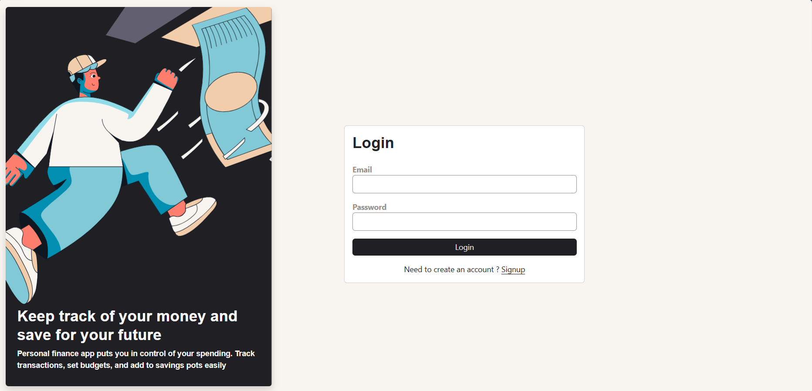
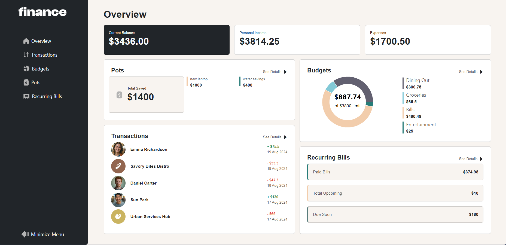
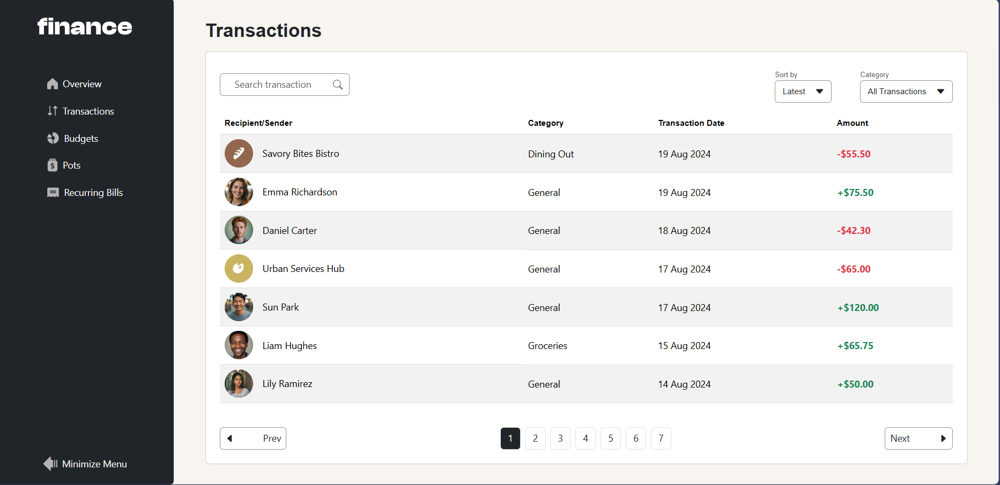
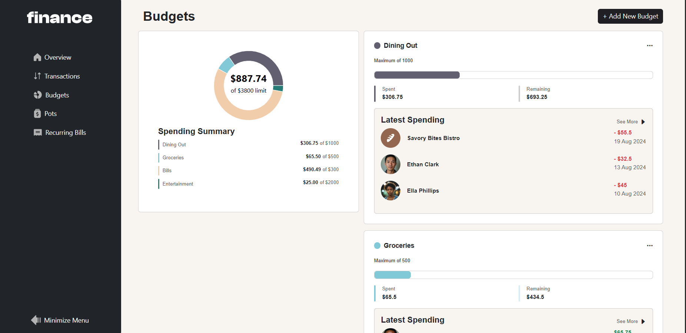
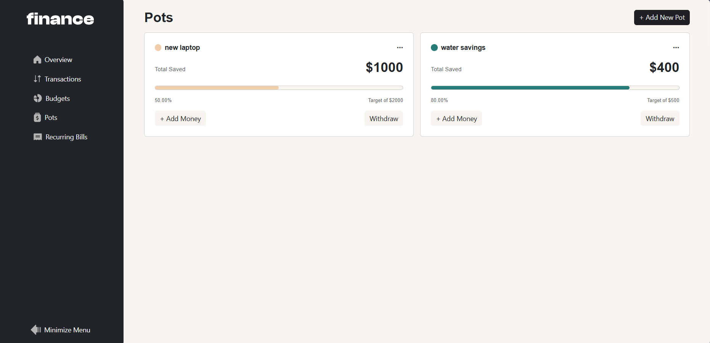
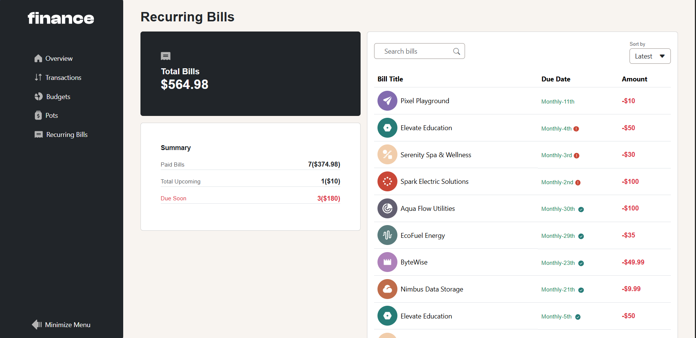

# Frontend Mentor - Personal finance app solution

This is a solution to the [Personal finance app challenge on Frontend Mentor](https://www.frontendmentor.io/challenges/personal-finance-app-JfjtZgyMt1). Frontend Mentor challenges help you improve your coding skills by building realistic projects.

## Table of contents

- [Overview](#overview)
  - [The challenge](#the-challenge)
  - [Screenshot](#screenshot)
  - [Links](#links)
- [My process](#my-process)
  - [Built with](#built-with)
  - [What I learned](#what-i-learned)
  - [Continued development](#continued-development)
  - [Useful resources](#useful-resources)
  - [AI Collaboration](#ai-collaboration)
- [Author](#author)

## Overview

### The challenge

Users should be able to:

- See all of the personal finance app data at-a-glance on the overview page
- View all transactions on the transactions page with pagination for every ten transactions
- Search, sort, and filter transactions
- Create, read, update, delete (CRUD) budgets and saving pots
- View the latest three transactions for each budget category created
- View progress towards each pot
- Add money to and withdraw money from pots
- View recurring bills and the status of each for the current month
- Search and sort recurring bills
- Receive validation messages if required form fields aren't completed
- Navigate the whole app and perform all actions using only their keyboard
- View the optimal layout for the interface depending on their device's screen size
- See hover and focus states for all interactive elements on the page
- **Bonus**: Save details to a database (build the project as a full-stack app)
- **Bonus**: Create an account and log in (add user authentication to the full-stack app)

### Screenshots

### Links

- Solution URL: (https://github.com/abdalsimam1-sketch/personal-finance-app.git)
- Live Site URL: (https://personal-finance-app-neon-beta.vercel.app/)

## My process

### Built with

- Semantic HTML5 markup
- CSS3
- Bootstrap
- Bootstrap-icons
- Mobile-first workflow
- [React](https://reactjs.org/) - JS library
- Supabase (Backend as a service for authentication and database)
- Context API(Global state management )
- React-router-dom
- Vercel
- PostgresSQL

### What I learned

- Learnt how to write good PR descriptions
- Learnt more about array methods while working with the static JSON file
- Learnt how to use supabase auth
- Learnt how to add env file to gitignore so it won't be pushed to github
- Learnt how to add my env varibales to my vercel deployment
- Learnt how to connect and make supabase database queries
- Learnt to work with formstate and also form submissions better that
- Leanrt how to manage error and loading states for async functions
- Learnt to use hooks like useMemo to boost performance and reduce heavy re-calculations

### Continued development

- Deepen understanding of API fetching and integration
- Learn more about database table relationships
- Learn how to improve app performance for better user experience
- Learn to use real life data

### AI Collaboration

- Used AI tools like Codex, ChatGPT, CLaude, Gemini and Github Copilot
- Used them for debugging issues when stuck
- Used AI to learn professional workflows and also brainstrom new patterns
- Used AI for explanations of new concepts
- Used AI to to significantly reduce development time by doing letting it do thigns like the color definitions and fonts and spacing and other design system varible definitions

**What worked well**

- Faster debugging and proeblem solving
- Leanring new concepts faster and in more efficient ways

**What didn't work well**

- Some answers were very genric and were not really answering the asked question
- Needed to verify AI genrated solutions across mulitple AI tools to make sure of the correct solution

## Author

- Frontend Mentor - [@abdalsimam1-sketch](https://www.frontendmentor.io/profile/abdalsimam1-sketch)
